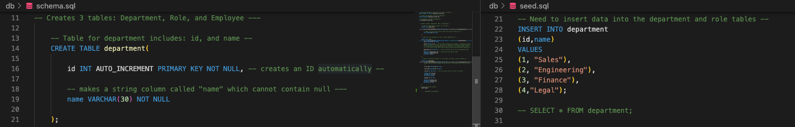

# Creating an Employee Tracker Using SQL


## Description

Keeping track of employees of a business is an important and crucial task. There are constant updates that need to be made regarding the information of an employee, including:
  * Name, 
  * Role,
  * Department and, 
  * Salary, which is last, but certaintly not least.

So, in order to keep all of this useful information in one place, I created a database using SQL. Within the database, I created 3 tables- an employee table, a roles table, and a department table. Please continue to read to learn more about how how I created them! 
----
## Table of Contents 

  * [Installation](#installation)
  * [Usage](#usage)
  * [License](#license)
  * [Contribution](#contribution)
  * [Tests](#tests)
  * [Technologies](#technologies)
  * [Questions](#questions)

---
## Installation

To use the npm packages, "inquirer" and "mysql2", I typed the following code into the command line:

```
npm i inquirer@8.2.4 mysql2
```

The npm package, "console.table" was also utilized. The following was typed into the command line to install it: 

```
npm i console.table --save
```


---

## Usage

  The first step to my tracker was creating a database that would hold the data I wanted to track. In order to do that, I created a schema file. Within this file, databases can be dropped (deleted), created, and used. Typically, when creating a database, it's best to "drop it" first. This ensures you're starting fresh, when you create your new database. You can see the steps I took in the screenshot below!

  

  The schema file not only holds the creation of the database, but also its' tables. Every table needs data in order for it to be useful. So, once the tables are made, a seed file has to be created. The seed file inserts the data into the tables created within the schema. Below is a screenshot of the code I wrote for the department table. The schema file is on the left and the seed file is to the right. 
  
  

  Notice how in the schema file, I'm creating the table.  For department, I wanted the table to provide an ID and name. Then look to the seed file. There is where I insert the data I want to feed into my table. 

  
  My next step was to utilize JavaScript. I created a connection.js file that connected SQL to the terminal, and then created an index.js file that contained the questions I wanted to run inside the terminal.I used the npm package, inquirer, to create the questions. Click [here](https://app.castify.com/view/9b552a22-1fd3-43e7-b6f9-6ce1346c4acd), to view a quick demo of how the questions appeared within the terminal! 

Once I was ready to run the server, I did so by typing this line of code into the terminal: 

```
node index.js
```


---

## Contribution

  None.

  ---

## License

```
This project is licensed under MIT.
```

---


## Tests

None.

 ---

 ## Technologies

* JavaScript
* SQL 
* MySQLWorkbench
* Node
    * npm packages:
       * [inquirer](https://www.npmjs.com/package/inquirer?activeTab=readme)
       * [mysql2](https://www.npmjs.com/package/mysql2)
       * [console.table](https://www.npmjs.com/package/console.table)
* VS Code

 ---

## Questions

If you'd like to see more of my projects, check out my github: [amylipscomb](https://github.com/amylipscomb).
For further information please contact me at [amy.a.lipscomb@gmail.com](mailto:amy.a.lipscomb@gmail.com)!